<div align="center">
  
 
# FitVerse
 
### Your AI-driven personal coaching ecosystem
 
[](https://flutter.dev)
[](https://dart.dev)
[](https://android.com)
[](CHANGELOG.md)
[](LICENSE)
 
**FitVerse** combines real-time biometric tracking, an accelerometer-powered live form coach, a 93-exercise workout library, and a Gemini-powered AI coach — synced to the cloud so your progress follows you across devices.
 
[**Download APK**](#installation) · [**Features**](#features) · [**Screenshots**](#screenshots) · [**Build It**](#building-from-source)
 
</div>
---
 
## Why FitVerse?
 
Most fitness apps either lock real coaching behind a subscription or give you a library of exercises with no idea who you are. FitVerse builds a live profile of your body, your health conditions, and your workout history, then feeds that context straight into Google's Gemini model so every piece of advice — nutrition, recovery, muscle-building — is actually personalized. Biometrics come from Google Health Connect when available, with a self-built adaptive accelerometer pedometer as a fallback that keeps working even without a smartwatch. Everything is cached locally first for an instant UI, then synced to Firestore so a new device picks up your full history the moment you sign in.
 
---
 
## Features
 
### 🔐 Authentication & Onboarding
- **Google Sign-In** bridged to a **Firebase Auth** session on every sign-in, so `request.auth.uid` is always populated for Firestore security rules
- 4-state auth machine: `unknown → unauthenticated → newUser → authenticated`, with silent session restore (`signInSilently()`) on cold start
- Guided onboarding: intro carousel → profile setup → optional health conditions screen
- **Profile setup** captures name, age, gender, height, weight, and fitness goal (**Build Muscle**, **Lose Weight**, **Improve Endurance**, **General Fitness**, **Athletic Performance**)
- **Health conditions checklist** — 8 presets (Mild Asthma, Type 2 Diabetes, Hypertension, Knee Pain, Lower Back Pain, Heart Condition, Obesity, Arthritis), fully optional, feeds directly into the AI Coach's context
### 🏠 Home Dashboard
- Live metric cards: **heart rate**, **blood oxygen (SpO2)**, **steps**, **calories burned** — sourced from Health Connect or the accelerometer fallback
- 7-day activity bar chart (`fl_chart`)
- Recent workout history cards
- AI-generated nutrition/recovery suggestion banner
- Stats row (**Workouts** / **Total kcal** / **BMI**) — always recomputed live from the session list, never from a potentially stale cached counter
### 🏋️ Workout Library
- **20 muscle groups** · **93 exercises** · **18 curated multi-exercise presets**
- Interactive **anatomical body map** (custom-painted, front/back toggle) to browse exercises by muscle group
- Every exercise includes difficulty, equipment, sets/reps, step-by-step instructions, form cues, calorie estimate, and muscles worked
- Animated exercise previews pulled from the [free-exercise-db](https://github.com/yuhonas/free-exercise-db) GitHub repo, with an emoji fallback when no animation is available
- **Preset workout mode** chains a sequence of exercises into one combined, saved session
### 📡 Live Form Tracking
- Accelerometer-based **rep counting** and **form-quality scoring** while you train
- Runs the same four-stage adaptive signal pipeline as the step counter (gravity removal → dynamic magnitude → smoothing → adaptive peak detection), separately tuned for resistance-exercise cadence
- Spoken correction cues via **Flutter TTS**, throttled by a cooldown timer so they never feel spammy
- **Solo mode** (saves on exit) and **preset mode** (aggregates each exercise sub-session into one combined record)
- Auto-generates an AI workout report the moment you finish
### 🤖 AI Coach (Gemini)
- **Gemini 2.5 Flash**-powered chat that's fully aware of your profile, BMI, health conditions, and last 5 workout sessions
- Quick-prompt chips: workout history analysis, post-workout nutrition, muscle-building tips, rest recommendations, recovery routines
- Context **silently refreshes** as new sessions are logged — no chat wipe, no losing your conversation
- Persistent chat history, stored per-user in Firestore
- **Bring your own API key** — use the built-in default or add a personal Gemini key from [ai.google.dev](https://aistudio.google.com/app/apikey) for higher rate limits; keys are validated and masked in Settings
### ❤️ Health & Activity Tracking
- Two mutually-exclusive data pipelines, switched automatically:
  - **Google Health Connect** — live heart rate, SpO2, steps, and active calories, refreshed on a 5-second timer
  - **Adaptive accelerometer pedometer** — a self-built fallback (20 Hz sampling) for devices or watches without Health Connect
- A foreground service keeps step counting alive while the app is backgrounded
- Live vs. cached readings are visually distinguished in the UI
- Daily health snapshots synced to Firestore for cross-device history
### ☁️ Cloud Sync (Firestore)
- Every profile edit, finished workout, and daily health snapshot is cached **instantly** to local storage, then pushed asynchronously to Firestore
- On login, your cloud profile and last 50 sessions are fetched and **merged** with anything saved locally (union by session ID) — log in on a new phone and your history is already there
- Workout and calorie counters are **always recomputed** from the full session list and silently patched if drift is detected — they're never trusted as a running total
- Works fully offline: Firestore queues writes locally and auto-retries the moment connectivity returns
- Security rules enforce strict per-user ownership and reject any document containing credential-like fields (`passwordHash`, `token`, `refreshToken`, `secret`, `credential`)
### 👤 Profile & ⚙️ Settings
- Edit your profile fields; view BMI and BMI category at a glance
- Toggle **voice alerts** (TTS form corrections) on or off
- **Connect / disconnect** Google Health Connect
- Manage your **Gemini API key** — add a personal key, update it, or reset to the built-in default
- **Clear workout history** with a confirmation step
- Sign out (clears local provider state; auth routing returns you to onboarding)
### 🎨 App Icon & Splash
- Adaptive icon (legacy, round, and adaptive-foreground variants) generated across all Android densities
- Dark teal splash screen with the centred FV logo
---
 
## Screenshots
 
> Place your screenshots in `screenshots/` with the filenames below.
 
| Onboarding | Sign In | Profile Setup |
|------------|---------|----------------|
| 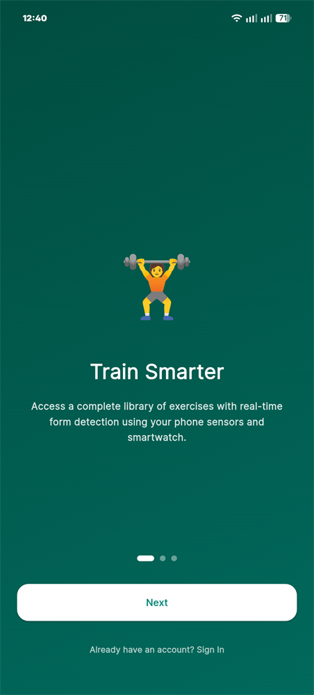 | 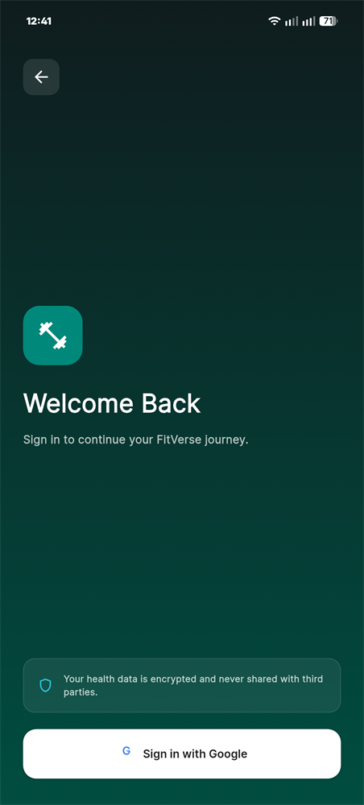 | 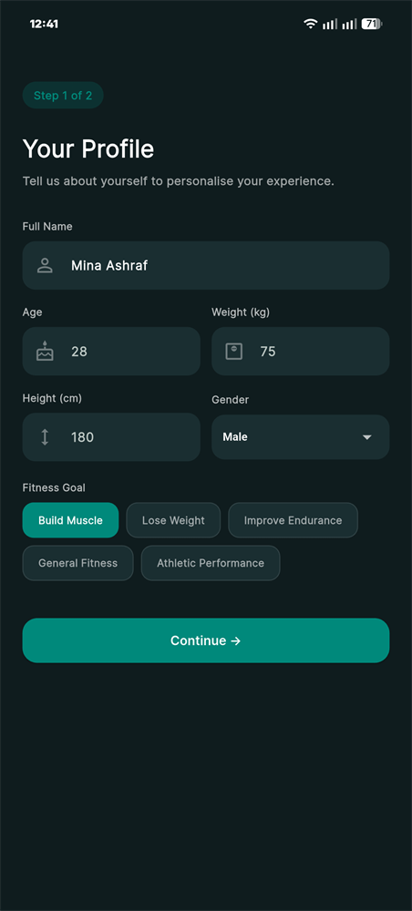 |
 
| Home | Workouts | Muscle Exercises |
|------|----------|-------------------|
| 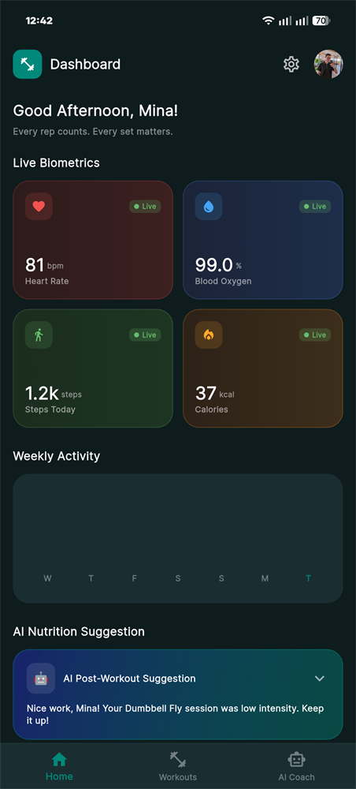 | 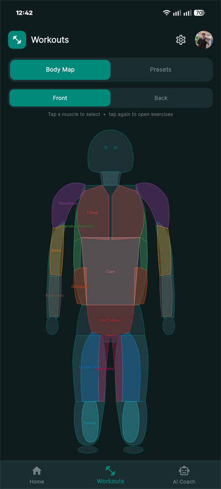 | 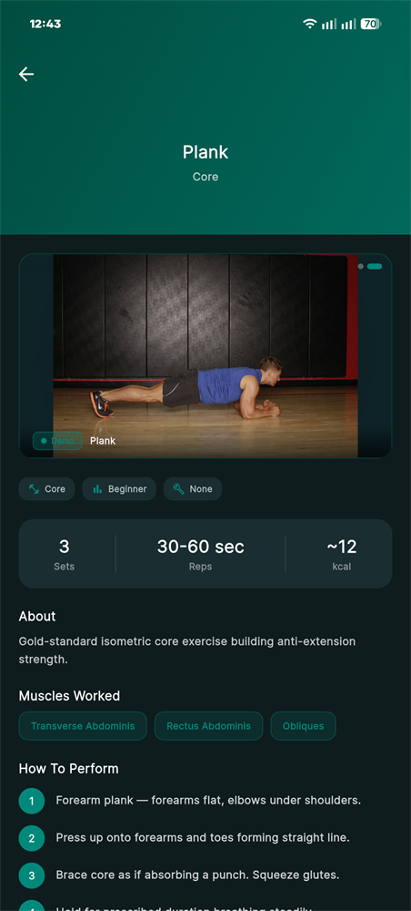 |
 
| Live Tracking | Preset Workout | AI Coach |
|----------------|------------------|----------|
| 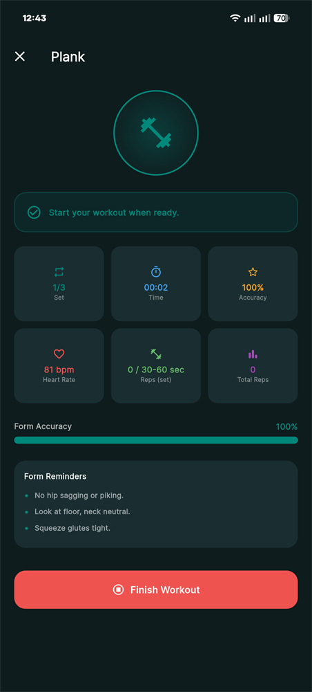 | 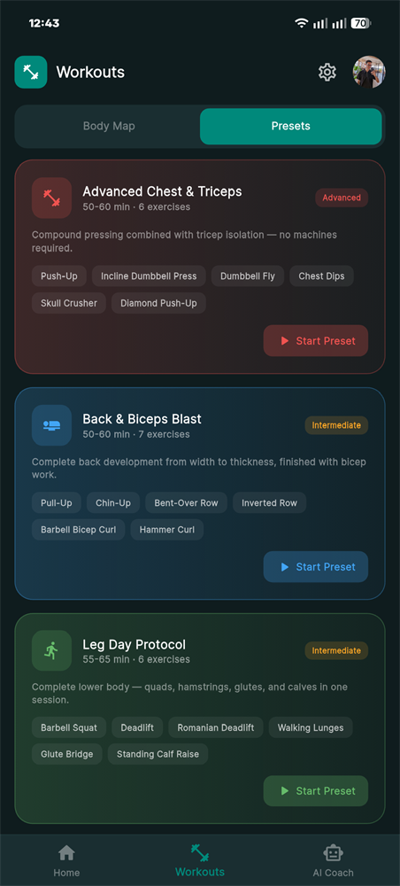 | 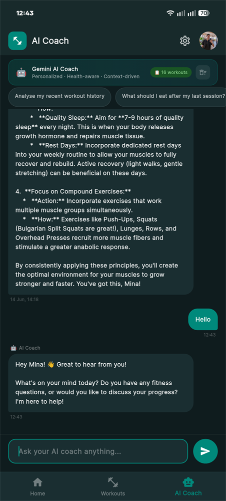 |
 
| Profile | Settings | Health Connect |
|---------|----------|------------------|
| 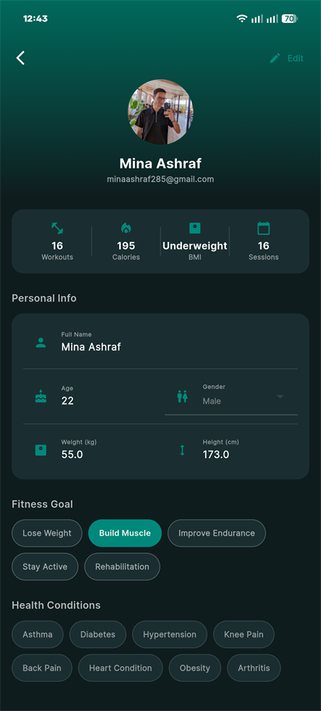 | 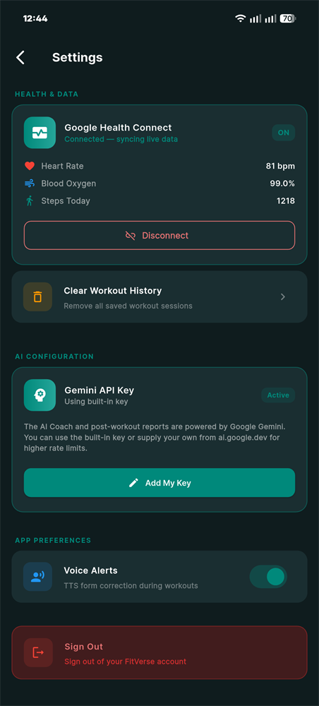 | 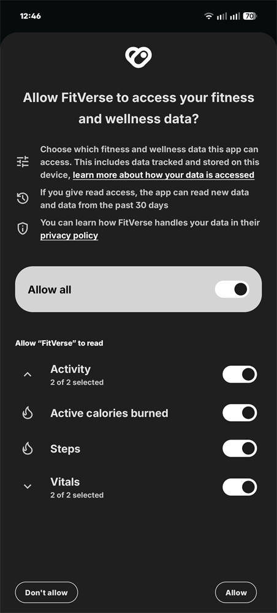 |
 
---
 
## Navigation
 
```
Bottom bar:    Home · Workouts · AI Coach
AppBar (modal): Profile · Settings
```
 
---
 
## Tech Stack
 
| Layer | Technology |
|-------|-----------|
| **Framework** | Flutter (Dart SDK `>=3.2.0 <4.0.0`) |
| **State** | provider ^6.1.2 (ChangeNotifier) |
| **Auth** | google_sign_in ^6.2.1 + firebase_auth ^5.3.1 |
| **Database** | cloud_firestore ^5.4.5 — per-user documents, offline persistence enabled |
| **Firebase Core** | firebase_core ^3.8.0 |
| **AI** | google_generative_ai ^0.4.6 — Gemini 2.5 Flash |
| **Health** | health ^12.0.0 — Health Connect (Android) |
| **Sensors** | sensors_plus ^4.0.2 — accelerometer pipeline |
| **Permissions** | permission_handler ^11.3.1 |
| **Voice** | flutter_tts ^4.0.2 |
| **Charts** | fl_chart ^0.68.0 |
| **Local Cache** | shared_preferences ^2.3.2 |
| **HTTP** | http ^1.2.2 — optional web backend sync |
| **Fonts** | google_fonts ^6.2.1 (Inter) |
| **Images** | cached_network_image ^3.3.1 |
| **Date Formatting** | intl ^0.19.0 |
| **UUIDs** | uuid ^4.4.2 |
 
All financial — sorry, *physical* — data lives in a two-layer cache: SharedPreferences for instant UI, Firestore as the authoritative cloud store. The app works fully offline using the local cache and syncs automatically once connectivity returns.
 
---
 
## Project Structure
 
```
lib/
├── main.dart                          # Entry point — Firebase init, Provider tree
├── app.dart                           # FitVerseApp widget, auth-state routing
├── firebase_options.dart              # Platform-specific Firebase config
├── core/
│   ├── constants/
│   │   └── workout_data.dart          # 20 muscle groups, 93 exercises, 18 presets
│   └── theme/
│       └── app_theme.dart             # Dark Material 3 theme, design tokens
├── models/
│   ├── user_model.dart                # UserModel + BMI helpers
│   └── workout_model.dart             # MuscleGroup, Exercise, WorkoutPreset,
│                                       #   SessionModel, ChatMessage
├── providers/
│   ├── auth_provider.dart             # Google Sign-In + Firebase Auth bridge
│   ├── user_provider.dart             # Profile CRUD, sessions, Firestore sync
│   ├── health_provider.dart           # Health Connect + adaptive accelerometer pipeline
│   ├── workout_provider.dart          # Live tracking, rep counting, TTS cues
│   └── ai_provider.dart               # Gemini chat session + workout report gen
├── services/
│   └── web_sync_service.dart          # Fire-and-forget HTTP sync to an optional backend
└── features/
    ├── auth/
    │   ├── onboarding_screen.dart
    │   ├── sign_in_screen.dart
    │   ├── profile_setup_screen.dart
    │   └── health_conditions_screen.dart
    ├── main/
    │   └── main_shell.dart            # IndexedStack bottom nav (3 tabs)
    ├── home/
    │   ├── home_screen.dart           # Dashboard — metrics, chart, history, AI banner
    │   └── widgets/
    │       ├── metric_card.dart
    │       ├── workout_history_card.dart
    │       └── ai_suggestion_banner.dart
    ├── workouts/
    │   ├── workouts_screen.dart       # Anatomical body map + muscle group tabs
    │   ├── muscle_exercises_screen.dart
    │   ├── workout_detail_screen.dart
    │   ├── live_tracking_screen.dart  # Live rep counting + form coaching
    │   └── preset_workout_screen.dart # Multi-exercise preset sequencing
    ├── ai_coach/
    │   └── ai_coach_screen.dart       # Gemini chat UI + quick prompts
    ├── profile/
    │   └── profile_screen.dart
    └── settings/
        └── settings_screen.dart       # Voice alerts, Health Connect, API key, sign out
```
 
---
 
## Building from Source
 
### Prerequisites
 
| Tool | Version | Download |
|------|---------|---------|
| Flutter SDK | 3.19+ | [flutter.dev](https://flutter.dev/docs/get-started/install) |
| Android Studio | Latest | [developer.android.com/studio](https://developer.android.com/studio) |
| Java JDK | 17+ | [adoptium.net](https://adoptium.net/) |
| Firebase CLI | Latest | `npm install -g firebase-tools` |
 
```bash
flutter doctor
```
 
---
 
### Step 1 — Clone & Install Dependencies
 
```bash
git clone <your-repo-url> fitverse
cd fitverse
flutter pub get
```
 
---
 
### Step 2 — Configure Firebase
 
FitVerse uses **Firebase Auth** (Google Sign-In bridge) and **Cloud Firestore** (cross-device sync).
 
1. Go to [Firebase Console](https://console.firebase.google.com) and create a project
2. Run `flutterfire configure` to generate your own `lib/firebase_options.dart`
3. Download `google-services.json` and place it at:
```
   android/app/google-services.json
```
4. Enable **Firestore Database** (production mode) and deploy the bundled rules:
```bash
   firebase login
   firebase init firestore     # select your project
   firebase deploy --only firestore:rules
```
 
See [`FIRESTORE_SETUP.md`](FIRESTORE_SETUP.md) for the full schema, sync behaviour, and security rule details.
 
---
 
### Step 3 — Configure Google Sign-In
 
1. In [Google Cloud Console](https://console.cloud.google.com), open the Firebase-linked project
2. Under **APIs & Services → Credentials → OAuth 2.0 Client IDs**, create:
   - **Android client** with your SHA-1 fingerprint
   - **Web client** (required for Firebase Auth token validation)
#### Get your SHA-1 fingerprint:
```bash
# For debug builds
keytool -list -v -keystore ~/.android/debug.keystore -alias androiddebugkey -storepass android -keypass android
 
# For release builds
keytool -list -v -keystore /path/to/your/release.keystore -alias your_alias
```
 
---
 
### Step 4 — Configure Gemini API Key
 
1. Visit [Google AI Studio](https://aistudio.google.com/app/apikey) and create a key
2. Open `lib/providers/ai_provider.dart`
3. Replace the placeholder:
```dart
   // BEFORE
   const _kGeminiKey = 'YOUR_GEMINI_API_KEY';
 
   // AFTER
   const _kGeminiKey = 'AIza...your-actual-key...';
```
 
> End users can also supply their own key from inside the app — see **Settings → Gemini API Key**.
 
---
 
### Step 5 — Health Connect Setup
 
Health Connect requires **Android 8.0+ (API 26)** and the **Health Connect app** installed on the device.
 
1. Install Health Connect from the [Play Store](https://play.google.com/store/apps/details?id=com.google.android.apps.healthdata)
2. The app requests permissions on first launch
3. For Wear OS smartwatch data, pair your watch and enable Health Connect sync in the Wear app
**Required Health Connect permissions** (already declared in `AndroidManifest.xml`):
- `android.permission.health.READ_HEART_RATE`
- `android.permission.health.READ_OXYGEN_SATURATION`
- `android.permission.health.READ_STEPS`
- `android.permission.health.READ_ACTIVE_CALORIES_BURNED`
> If Health Connect is unavailable or permissions are denied, FitVerse falls back to its own adaptive accelerometer pedometer — no biometric data is ever lost.
 
---
 
### Step 6 — Run the App
 
```bash
# Debug mode
flutter run
 
# Release APK
flutter build apk --release
 
# Release AAB (for Play Store)
flutter build appbundle --release
```
 
---
 
## Installation
 
1. Go to **Releases** (or build the APK yourself — see above)
2. Download `app-release.apk`
3. On your phone: **Settings → Security → Install Unknown Apps** → enable for your file manager
4. Open the APK and install
> Minimum Android: **8.0 (API 26)** — required by the `health` package for Health Connect
 
---
 
## Gradle / Build Config
 
| Component | Version |
|-----------|---------|
| Gradle | **8.10.2** |
| Android Gradle Plugin | **8.7.3** |
| Kotlin | **2.1.21** |
| Java / Kotlin target | 17 |
| `google-services` plugin | 4.4.2 |
| Namespace | `com.fitverse.app` |
| Application ID | `com.ma.fitverse` |
| compileSdk / targetSdk | 36 |
| Min SDK | 26 (Android 8.0) |
| NDK | 28.2.13676358 |
 
> **`MainActivity` must extend `FlutterFragmentActivity`** (not `FlutterActivity`) — required for Health Connect's `ActivityResultLauncher` to register correctly.
> **Health Connect permission name is `READ_OXYGEN_SATURATION`**, not `READ_BLOOD_OXYGEN` — a single typo here silently fails the entire `requestAuthorization()` call.
> **Adaptive icon foreground must live in `mipmap-*`** (referenced as `@mipmap/ic_launcher_foreground`), not `drawable/` — otherwise release builds fail with an AAPT link error.
 
---
 
## Android Permissions
 
| Permission | Purpose |
|-----------|---------|
| `INTERNET` | Firebase sync, Gemini API calls, exercise GIF previews |
| `ACCESS_NETWORK_STATE` | Check connectivity before network calls |
| `BODY_SENSORS` / `BODY_SENSORS_BACKGROUND` | Accelerometer-based rep counting and step detection |
| `ACTIVITY_RECOGNITION` | Required for step counting on Android 10+ |
| `health.READ_HEART_RATE` | Health Connect heart rate |
| `health.READ_OXYGEN_SATURATION` | Health Connect blood oxygen |
| `health.READ_STEPS` | Health Connect steps |
| `health.READ_ACTIVE_CALORIES_BURNED` | Health Connect active calories |
| `POST_NOTIFICATIONS` | Workout and reminder notifications |
| `RECEIVE_BOOT_COMPLETED` | Restore foreground service state after reboot |
| `VIBRATE` / `WAKE_LOCK` | Live tracking feedback and screen-on during workouts |
| `FOREGROUND_SERVICE` / `FOREGROUND_SERVICE_HEALTH` | Background step counting service |
| `RECORD_AUDIO` | Required by the text-to-speech engine on some OEM builds |
 
---
 
## Data & Privacy
 
- ✅ Profile, sessions, and health snapshots are cached locally first — the app works fully offline
- ✅ Cloud sync via **Firestore** is opt-in by virtue of signing in; data is owned per-user and enforced by security rules (`request.auth.uid == uid`)
- ✅ Documents containing credential-like fields (`passwordHash`, `token`, `refreshToken`, `secret`, `credential`) are rejected by the security rules — Firebase Auth never passes credentials to the app's data layer
- ⚠️ AI Coach conversations and workout context (profile, BMI, health conditions, recent sessions) are sent to **Google's Gemini API** to generate responses — review [Google's Gemini API terms](https://ai.google.dev/gemini-api/terms) before relying on this for sensitive health data
- ✅ You can supply your own Gemini API key in Settings instead of using the built-in default
- ✅ No ads, no third-party analytics or crash reporting beyond Firebase's own infrastructure
---
 
## Troubleshooting
 
**`flutter pub get` fails**
```bash
flutter clean && flutter pub get
```
 
**Health Connect permissions not granted / silently fails**
Double-check the manifest permission is `android.permission.health.READ_OXYGEN_SATURATION`, **not** `READ_BLOOD_OXYGEN`. A mismatch here fails the whole authorization request without an obvious error.
 
**`AAPT: error: resource drawable/ic_launcher_foreground not found`**
The adaptive icon foreground must be placed in `mipmap-*` folders, not `drawable/`. Move it and rebuild.
 
**Stats (Workouts / Total kcal) showing zero despite having sessions**
This is the known counter-drift issue — `UserProvider._pullSessions()` recomputes and patches the Firestore document automatically on the next sync. Force a sync by pulling to refresh or restarting the app.
 
**Gradle build fails on classpath / `io.flutter.*` not found**
Ensure the Flutter Gradle plugin is loaded via `includeBuild` from your local Flutter SDK in `settings.gradle` — never pin it as a separate Maven dependency.
 
**Accept Android SDK licenses**
```bash
flutter doctor --android-licenses
```
 
**Gemini Coach not responding**
Check **Settings → Gemini API Key** — the status badge will read "Not configured" if the active key doesn't start with `AIza`. Add your own key from [ai.google.dev](https://aistudio.google.com/app/apikey).
 
---
 
## .gitignore
 
```gitignore
# Flutter / Dart
.dart_tool/
.flutter-plugins
.flutter-plugins-dependencies
.packages
.pub-cache/
.pub/
build/
*.lock
 
# Android
android/local.properties
android/.gradle/
android/captures/
android/gradlew
android/gradlew.bat
android/gradle/wrapper/gradle-wrapper.jar
*.apk
*.aab
*.keystore
*.jks
 
# Google Services — NEVER commit these
android/app/google-services.json
ios/Runner/GoogleService-Info.plist
 
# API Keys — NEVER commit
.env
.env.local
secrets.dart
**/secrets.dart
 
# macOS / iOS
ios/
macos/
*.xcworkspace/
Pods/
*.xcuserstate
 
# IDE
.idea/
.vscode/
*.iml
*.ipr
*.iws
.DS_Store
Thumbs.db
 
# Coverage
coverage/
*.lcov
```
 
---
 
## Roadmap
 
- [x] Google Health Connect integration with adaptive accelerometer fallback
- [x] Firestore cloud sync with cross-device session merge
- [x] Gemini-powered AI Coach with personalized context
- [x] Live accelerometer-based rep counting and form coaching
- [x] Bring-your-own Gemini API key
- [ ] iOS support (HealthKit equivalents for the Health Connect pipeline)
- [ ] Automated test coverage (`flutter_test` is wired up, no tests yet)
- [ ] Move the built-in Gemini key off a hardcoded constant before any public release
- [ ] Local caching/fallback for exercise preview GIFs (currently CDN-dependent)
- [ ] Home screen widget (today's steps / streak)
- [ ] Localisation / multiple languages
---
 
## Contributing
 
1. Fork the repository
2. Create a branch: `git checkout -b feature/my-feature`
3. Commit: `git commit -m "Add my feature"`
4. Push: `git push origin feature/my-feature`
5. Open a Pull Request
Code style: providers are `ChangeNotifier`s accessed via `context.read<X>()` for one-time calls and `context.watch<X>()` for reactive rebuilds; derive counters (`totalWorkouts`, `totalCalories`) from the live session list, never from the cached model fields; `flutter analyze` must pass.
 
---

## License

MIT License — see [LICENSE](LICENSE) for full text.  
Copyright © 2026 [Mina Android](https://github.com/mina-android)

---

<div align="center">

Made with ❤️ and Flutter · [**More projects by Mina Android**](https://github.com/mina-android) · [**⬆ Back to top**](#fitverse)

</div>
